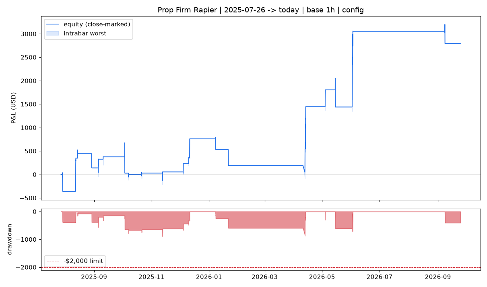

# Prop Firm Rapier

A multi-timeframe **Bias + OTE** (ICT Optimal Trade Entry) trading bot for **NQ / Nasdaq-100 futures**,
built for prop-firm rules (hard $2,000 drawdown, flat before the daily close, every trade planned at ≥ 1R).
It is a rebuild of the "Bee Sid" NQ bot's golden-belt idea (bias → price action → OTE → targets) as a
standalone, tested, look-ahead-free engine with a backtester, a refinement loop and a paper/live signal loop.

> **Honest headline:** the refinement loop searched 4,600+ configurations with an out-of-sample guard.
> It found a system that stays **under the $2,000 drawdown, plans every trade at ≥ 1R and is profitable
> in both test periods**. It did **not** find a robust way to get a **75% win rate** or an **$11,000 single
> trade** without breaking the drawdown rule. The config that did print an $11.6k trade was a curve-fit
> that lost money with a $10k drawdown on the prior year, so it was rejected. Details below.

## Strategy

For each timeframe the engine looks for an OTE setup (longs shown; shorts mirror):

1. **Bias** – market structure on higher timeframes: bullish after a close above the last confirmed
   swing high, bearish after a close below the last confirmed swing low. Books only trade with bias.
2. **Leg** – anchor = most recent confirmed swing low (fractal, `k` bars each side, used only after it is
   confirmed); leg high = highest high since. The leg must **break structure** (exceed the prior swing high)
   and be at least `min_leg × ATR` (displacement).
3. **OTE entry** – limit at the 0.62 / 0.705 / 0.79 retracement of the leg, or (`confirm`) wait for a
   rejection close inside the OTE and enter at that close.
4. **Stop** beyond the anchor (+0.1 ATR). **Target** ≥ 1R always (enforced in code).
5. **Context filters** available: daily premium/discount, midnight open, session open, prior-day
   high/low sweep, session windows.

### Books (multiple timeframe OTEs)

| book | timeframe | bias | entry | exit | holds |
|---|---|---|---|---|---|
| `swing-4h` | 4h OTE @0.62 | 1D + 4h + 1h aligned | limit | 34% off at 1R, stop → BE, runner trails 4h swings | intraday (prop mode) or overnight (swing mode) |
| `ote-1h` | 1h OTE @0.62 | 1D | limit, NY session, needs prior-day sweep | **1.25R** | intraday |
| `scalp-5m` | 5m OTE @0.705 | 1D + 1h | confirmation, NY session | **1R** | intraday |
| `scalp-15m` | 15m OTE | configurable | | 1R | disabled: did not hold up out-of-sample |

Risk: sized in **MNQ micros** (10 MNQ = 1 NQ) from a fixed dollar risk per trade ($400 swing / $200 1h /
$250 scalp), max 40 micros, $600 daily loss stop, one open position at a time, risk halved while drawdown
exceeds $800, everything flat by 16:40 ET in prop mode. Sizing in micros is deliberate: with 1h/4h stops of
50–150 NQ points, one full NQ contract risks $1,000–$3,000 per trade, which is incompatible with a $2,000
drawdown limit.

The final parameters live in [`rapier/rapier_config.json`](rapier/rapier_config.json).

## Results

All numbers are after commissions ($1.50 per micro round turn) and 1-tick slippage on stops, with a
conservative fill model (see *Backtest realism*). Drawdown is marked to the worst intrabar price.

| run | period | trades | win rate | net | max DD | best trade | PF |
|---|---|---|---|---|---|---|---|
| **Main (requested window)** | 2025-07-26 → 2026-09-24 | 20 | **60.0%** | **+$2,793** | **$892** | $1,614 | 2.25 |
| Out-of-sample (never optimised on) | 2024-06-15 → 2025-07-25 | 32 | 65.6% | +$1,925 | $992 | $400 | 1.70 |
| All three books on a 5m clock | 2026-07-20 → 2026-09-24 | 22 | 68.2% | +$1,629 | $754 | $246 | 2.28 |
| Swing-overnight variant | 2025-07-26 → 2026-09-24 | 19 | 63.2% | +$3,881 | $1,791 | $3,287 | 2.73 |

The 5m scalp book alone: 21 trades, 71% win rate, +$1,890. It was chosen on 2026-07-20→08-21 and held
72.7% on 2026-08-22→09-24 (11 trades each half). That is a tiny sample.

Reports (summary, monthly P&L, per-book table, trade list, equity/drawdown chart) are in [`results/`](results/).



### Goals scorecard

| goal | result |
|---|---|
| Every trade planned at ≥ 1R | ✅ enforced in code (`BookConfig` rejects < 1R); min planned RR = 1.00 |
| Max drawdown < $2,000 | ✅ $892 (main), $992 (OOS), $1,791 (overnight variant) |
| Shorter-timeframe OTEs mostly targeting 1R | ✅ 1h book targets 1.25R, 5m scalp targets 1R |
| Multiple timeframe OTEs | ✅ 4h, 1h, 5m live books (15m available) |
| Win rate ≥ 75% | ❌ 60% main / 66% OOS. Best in-sample anything reached with ≥20 trades was 71%, and it fell to 58% OOS |
| Single trade ≥ $11,000 | ❌ best robust trade $3,287 (overnight variant). The only $11.6k config had a $4.2k drawdown in-sample and lost $5.7k with a $10.2k drawdown out-of-sample |

Why these two goals were not forced:

* A ≥1:1 target with a 75% win rate means expectancy ≥ +0.5R per trade, profit factor ≥ 3. On this data,
  raw OTE touches hit 1R before the stop 42–50% of the time. The best ICT filters (bias alignment,
  discount, midnight open, sweeps, confirmation) lift that to about 55–66% robustly. Configs showing 75–80% on one
  half of the data dropped to 20–40% on the other half: that is curve-fitting, not edge.
* $11k in one trade with a $2k drawdown cap means risking roughly $300–500 and making 22–35R on a single trade.
  Flattening daily (prop rule), the largest favourable excursion of any OTE trade in 14 months was
  13.8R. That is ~$5.5k even with a perfect exit. It only becomes possible with overnight holds, and then it is a
  lottery ticket, not something you can tune for.

## Data and its limits

* Source: Yahoo Finance `NQ=F` (free). **1h bars cover the whole window.** **5m/15m bars only exist from
  2026-07-16** (Yahoo keeps ~60 days), so the 5m/15m books can only be backtested on the last ~2 months.
  `rapier fetch` appends to a local cache, so 5m history grows if you run it regularly. Any vendor CSV
  (Databento, TradingView export) can be loaded with `rapier.data.load_csv` for a full lower-TF backtest.
* The requested window "two years starting July 26 2025 to today" is **~14 months** (today is
  2026-09-24). The prior year (2024-06-15 → 2025-07-25) is used as untouched out-of-sample data, so the
  system has been checked across ~2.3 years in total.
* **Contract rolls:** `NQ=F` is unadjusted. It switches contracts in expiry week, and some roll-week bars mix
  both contracts (±245-pt flips). `rapier.data.roll_adjust` detects each switch, drops contaminated bars
  and back-adjusts history. Checked against the dated `NQZ26` contract: residual −7 to −36 pts
  after June 2026. Older checks are looser because `NQZ26` was illiquid. When a switch hides inside a weekend gap the
  adjustment uses theoretical carry (0.95% of price), which can be off by a few tens of points.
* Market data is not committed (`data/` is git-ignored).

## Backtest realism

* No look-ahead: swings are used only after confirmation; higher timeframes are read as of their last
  *completed* bar; context features come from the previous bar (unit-tested).
* Limit entries need a 1-tick trade-through. If stop and target could both be hit in one bar, **the stop
  wins**. On the fill bar a target only counts if the bar closes beyond it.
* 1h execution cannot see intrabar order, so some 1h results are pessimistic, not optimistic.
* Small samples: 20–32 trades per period. A 60% win rate on 20 trades has a wide confidence band
  (roughly 38–79%). Treat these results as evidence of a modest edge, not a guarantee.

## Usage

```bash
uv venv && uv pip install -e '.[dev]'
rapier fetch                                   # download / extend the bar cache
rapier backtest --start 2025-07-26             # main report -> results/latest
rapier backtest --base 5m --start 2026-07-20   # includes the 5m/15m scalp books
rapier backtest --mode swing                   # let the swing book hold overnight
rapier optimize --n 3000 --refine 4 --save     # re-run the refinement loop (IS + OOS guard)
rapier live                                    # paper signal loop, every 5 min
pytest
```

`rapier live` re-runs the same engine each cycle, then prints/journals `LIMIT` (entry, stop, target, micros),
`CANCEL`, `ENTRY` and `EXIT` events to `data/paper_journal.jsonl`. Set `RAPIER_DISCORD_WEBHOOK` to also
post them to Discord. Checked against history: 20/20 backtest limit fills in the main window were announced
as `LIMIT` orders before they filled. **It does not send real orders**. Connecting a broker (Tradovate,
Rithmic, IBKR) needs your own credentials; implement the `Broker` protocol in `rapier/live.py`. If you share
signals, remember CME real-time data redistribution rules.

Not financial advice. Backtests are not live results; prop-firm rules differ by firm, so check yours.

## Layout

```
rapier/data.py        fetch, cache, roll-adjust, resample (session-aligned 4h, CME trading day)
rapier/indicators.py  ATR, confirmed fractal swings, structure bias
rapier/strategy.py    OTE setup finder (any timeframe)
rapier/features.py    ICT context (premium/discount, sweeps, midnight/session open)
rapier/backtest.py    event-driven multi-book engine, prop risk rules, conservative fills
rapier/metrics.py     stats + goal checks
rapier/optimize.py    random + local search, ranked on the worse of IS/OOS
rapier/system.py      params -> books
rapier/live.py        paper/live signal loop
rapier/report.py      Markdown/JSON/CSV/PNG reports
```
